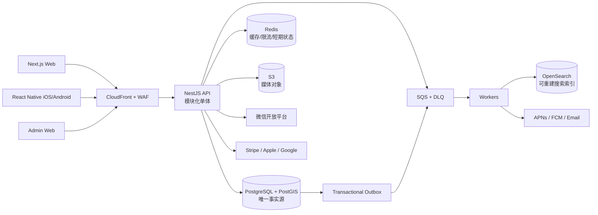

# 「澳中生活圈」网站 + App 产品设计与 Devin AI 开发任务书

> 文档版本：v1.0<br>
> 编写日期：2026-09-02<br>
> 目标读者：Devin AI、产品经理、UI/UX、前后端工程师、测试、运营与合规人员<br>
> 项目代号：`AUCN Hub`<br>
> 暂定中文名：**澳中生活圈**<br>
> 暂定英文名：**AUCN Hub**<br>
> 首发市场：澳大利亚（悉尼、墨尔本、布里斯班优先），服务在澳华人及与中国有连接的澳洲用户

---

## 0. 给 Devin AI 的执行指令

本文件既是产品设计书，也是开发验收依据。Devin 开始编码前必须：

1. 阅读全文，先输出实施计划、风险、待确认项和建议的技术取舍，不得直接生成大批量样板代码。
2. 在仓库创建 monorepo，并以可运行、可测试、可部署的小迭代交付；每个迭代均应有数据库迁移、测试和文档。
3. 优先完成 P0 闭环：注册登录 → 浏览 → 搜索 → 发布 → 互动/私信 → 举报/审核 → 商业发布/支付 → 管理后台。
4. 网站和 App 共用 API、领域模型、权限和设计语言，但必须针对平台分别优化，不得简单用 WebView 包装网站。
5. 所有密钥只允许通过环境变量或密钥管理服务配置；仓库仅提交 `.env.example`。
6. 默认采用严格隐私策略、最小权限、审计日志、限流和内容安全机制。
7. 不复制参考站的源代码、文案、品牌、图片、用户数据或视觉资产；只借鉴“资讯 + 论坛 + 分类信息 + 本地服务”的产品形态，重新设计信息架构与体验。
8. 凡涉及法律、税务、移民、医疗或金融的内容均须显示免责声明；上线前由澳大利亚执业律师和会计师复核合规方案。
9. 每个任务必须满足本文“完成定义（DoD）”，并附测试结果、截图/录屏和部署说明。

### 0.1 当前假设（如无产品负责人回复，按此执行）

| 项目 | 默认决定 |
|---|---|
| 产品名称 | 澳中生活圈 / AUCN Hub（上线前做商标与域名检索） |
| 语言 | 简体中文、英文；数据结构预留繁体中文 |
| 地区 | NSW、VIC、QLD 首发，其余州可浏览/发布 |
| Web | 响应式 Web + SEO + PWA 基础能力 |
| App | React Native + Expo，iOS/Android 双端 |
| 后端 | TypeScript + NestJS 模块化单体，成熟后再拆服务 |
| 数据库 | PostgreSQL + PostGIS；Redis；OpenSearch |
| 云平台 | AWS Australia（Sydney）Region，IaC 管理 |
| 用户认证 | 微信、Apple、Google、邮箱验证码、澳洲/国际手机号 OTP；微信为 P0 首发方式 |
| 支付 | Stripe；App 内数字权益遵循 Apple/Google IAP 规则 |
| 地图 | Google Maps Platform（用适配层隔离供应商） |
| 消息 | WebSocket + APNs/FCM + 邮件；短信仅用于高风险验证 |
| 发布节奏 | 先 PWA/Web 与后台，再双端 App；共用 API 与组件 token |

---

## 1. 项目愿景与边界

### 1.1 一句话定位

面向在澳华人与中澳跨境人群的可信本地生活平台，把**双语资讯、社区互助、分类信息、本地商家、活动与安全交易线索**集中在一个网站和一款 App 中。

### 1.2 用户问题

- 信息散落在微信群、社交媒体、论坛和多个分类网站中，搜索困难且容易过期。
- 新移民、留学生和游客不了解本地制度，中文信息缺乏上下文或可信来源。
- 租房、招聘、二手和服务交易中存在诈骗、冒充、押金与隐私风险。
- 本地华人商家缺少同时支持中文获客、地理定位、口碑和线索管理的平台。
- 用户需要中文交流，但也希望内容能被英语用户发现和理解。

### 1.3 产品原则

1. **可信优先**：来源、发布时间、资料完整度、认证状态、风险提示均可见。
2. **本地优先**：城市、州、距离是一级信息维度。
3. **任务优先**：围绕“找工作、找房、买卖、求助、找服务、参加活动”设计短路径。
4. **双语而非机翻堆砌**：UI 全量双语；用户内容可选 AI 翻译并明确标注。
5. **安全默认开启**：隐私号码、站内沟通、敏感信息检测、举报与反诈骗提醒。
6. **商业化不破坏信任**：广告清晰标注；付费不影响举报处置和基础信息可见性。
7. **无障碍与低门槛**：符合 WCAG 2.2 AA，兼顾长辈、新移民和低带宽用户。

### 1.4 不做什么（首发边界）

- 不直接托管房租押金、二手交易货款或工资，不作为交易合同一方。
- 不提供移民、法律、医疗、投资结论；认证专业人士可发布一般信息。
- 不做匿名端到端加密聊天，不承诺聊天内容不可审计。
- 不聚合或搬运受版权保护的全文新闻；只发布自有、授权内容或标题/摘要/链接。
- 不做面向中国境内的跨境资金转移、换汇撮合或现金交易。

### 1.5 成功指标（上线后 12 个月目标）

| 维度 | 指标 | 目标 |
|---|---|---:|
| 北极星 | 每周完成有效本地意图的用户数（保存/咨询/报名/申请/导航） | 30,000 |
| 获客 | 注册转化率 | ≥ 12% |
| 激活 | 新用户 7 天内完成一次有效意图 | ≥ 35% |
| 留存 | 消费型用户 D30 | ≥ 22% |
| 供给 | 有效分类信息 30 日留存量 | ≥ 10,000 |
| 社区 | 提问 24 小时内获得有效回复比例 | ≥ 70% |
| 安全 | 高危举报首次响应 | P95 < 30 分钟 |
| 质量 | 过期/重复信息曝光占比 | < 3% |
| 商业 | 商户免费到付费转化 | ≥ 5% |
| 商业 | 第 12 月订阅 MRR | 以财务模型批准目标为准 |

---

## 2. 参考产品拆解与差异化

参考 `https://incnjp.com/index` 所代表的海外华人门户形态：门户首页、多频道资讯、论坛交流、招聘/房产/二手等分类信息、本地商户与广告位。开发采用 clean-room 方法，只复用抽象产品模式。

### 2.1 保留的成熟模式

- 高频频道集中入口和城市化内容流。
- 社区论坛沉淀长尾经验与问答。
- 招聘、租房、二手、服务等强意图分类。
- 商户推广、置顶、展示广告等可验证的盈利模式。

### 2.2 必须改进的体验

| 传统门户痛点 | 澳中生活圈方案 |
|---|---|
| 首页拥挤、广告与正文难区分 | 卡片分区、个性化但可关闭；广告统一 `推广` 标识 |
| 内容按板块割裂 | 统一搜索、统一用户/商户身份、跨模块收藏与消息中心 |
| 帖子缺少结构化字段 | 房源、职位、商品、活动均使用专用 schema 和筛选器 |
| 信息过期或已成交仍展示 | 自动到期、发布者续期、状态管理、过期降权和批量清理 |
| 交易双方直接暴露电话/微信 | 默认站内私信；联系方式按发布者授权逐步展示 |
| 认证与广告容易混淆 | 身份认证、资质核验、商业推广三个独立标记 |
| 移动端只是缩小网页 | 原生导航、推送、相机上传、地图、深链和离线收藏 |
| 纯时间排序导致噪音 | 新鲜度、距离、质量、安全、相关性综合排序，可切换最新 |

### 2.3 澳洲本地化差异

- 地址结构、州/领地、邮编、时区、AUD、GST、ABN/ACN 字段。
- 房产信息明确 `整租/合租/转租`、租金周期、押金提示、账单、家具、入住日。
- 招聘明确 employment type、薪资单位、是否含 super、工作权利要求；禁止歧视性条件。
- 商家认证支持 ABN 查询结果留档，但不得暗示平台为政府背书。
- 紧急内容固定展示澳洲紧急电话 `000`；非紧急求助按州配置官方入口。
- 中国节日与澳洲公共假日并列，活动展示举办地时区。

---

## 3. 用户角色与权限

### 3.1 用户画像

1. **留学生小林**：找合租、兼职、二手家具和校园攻略，关注诈骗风险。
2. **新移民王女士**：寻找学校、医疗、本地办事指南和同城社群。
3. **专业人士 Alex**：中英文浏览行业资讯、活动和职业机会。
4. **商户陈老板**：管理门店资料、优惠、广告、咨询线索和评价回复。
5. **社区版主**：维护某城市或主题板块，处理普通举报和精华内容。
6. **编辑/运营**：发布资讯专题、活动、通知和商业活动。
7. **平台审核员**：处理举报、风控队列、申诉与证据保全。
8. **超级管理员**：权限、配置、账务视图和审计；日常不直接使用超级权限。

### 3.2 RBAC + ABAC

角色：`guest`、`member`、`verified_member`、`merchant_staff`、`moderator`、`editor`、`support`、`compliance`、`admin`、`super_admin`。

权限同时考虑资源归属、城市/板块范围、认证等级、账号风险分、内容状态。所有后台敏感操作需要 reason code 并写入不可变审计日志；客服不得查看完整支付信息或导出无关个人数据。

### 3.3 认证层级

- L0 游客：浏览公开内容。
- L1 邮箱或手机号验证：发帖、收藏、私信。
- L2 真人/身份验证：获得身份标记并提升部分额度；证件由合规供应商处理，平台不保存原图。
- B1 商户验证：邮箱/电话、ABN/ACN、自主声明。
- B2 资质验证：针对法律、房产、医疗、教育等行业记录资质类型、编号、签发机构、有效期与复核日期。

认证标记仅表示指定资料被核验，不代表服务质量担保。

---

## 4. 信息架构

### 4.1 Web 顶级导航

`首页` / `资讯` / `社区` / `租房` / `招聘` / `二手` / `商家服务` / `活动` / `实用工具`

全局区域包含：城市切换、全站搜索、发布按钮、消息、收藏、语言切换、个人中心。

### 4.2 App 底部导航

1. 首页
2. 发现（搜索、地图、频道）
3. 发布（中央主按钮，按类型引导）
4. 消息
5. 我的

二级模块用原生 Stack；详情页支持深链和分享回流。发布草稿自动保存。

### 4.3 URL 与深链

| 类型 | Web URL | App deep link |
|---|---|---|
| 资讯 | `/zh/news/{slug}` | `aucnhub://news/{id}` |
| 社区 | `/zh/community/{board}/{slug}` | `aucnhub://post/{id}` |
| 房源 | `/zh/housing/{city}/{slug}` | `aucnhub://listing/housing/{id}` |
| 职位 | `/zh/jobs/{city}/{slug}` | `aucnhub://listing/job/{id}` |
| 商品 | `/zh/marketplace/{city}/{slug}` | `aucnhub://listing/item/{id}` |
| 商家 | `/zh/business/{city}/{slug}` | `aucnhub://business/{id}` |
| 活动 | `/zh/events/{city}/{slug}` | `aucnhub://event/{id}` |

Web 使用 canonical URL、hreflang、结构化数据和可索引服务端渲染；私信、个人资料与后台禁止索引。

---

## 5. 完整功能需求

优先级：P0 = 首发必须；P1 = 上线后首个大版本；P2 = 增长阶段。

### 5.1 注册、登录与账号（P0）

- **微信认证列为 P0 首发能力**，与 Apple、Google、邮箱验证码、澳洲/国际手机号 OTP 同等优先。产品主体须尽早完成微信开放平台开发者认证、网站应用/移动应用创建、回调域名和 iOS Universal Links/Android 应用签名配置；若平台审核尚未完成，不得用假微信按钮冒充可用能力。
- Web 端提供“微信扫码登录”：后端生成一次性、短时有效且绑定浏览器会话的 `state`，用户扫码授权后由后端使用临时 `code` 换取身份结果，再通过一次性 ticket 通知原浏览器完成登录。二维码过期、取消、被另一浏览器消费时必须给出明确状态。
- iOS/Android 使用微信官方移动应用授权 SDK；如果设备未安装微信，显示邮箱、手机号、Apple/Google 等替代方式，不把用户困在当前页面。React Native 通过维护良好的原生桥接封装，微信 secret 只存在服务端，绝不打包进 App。
- 微信身份以开放平台返回的稳定主体标识为准：在满足开放平台绑定条件时优先用 `UnionID` 关联同一主体下的网站与移动应用，同时保留应用级 `OpenID`。不得用昵称、头像、手机号或可变资料作为唯一键。
- 微信首次授权只申请登录必要的最小 scope；头像、昵称等资料可由用户确认或稍后修改。平台自己的 `user_id` 是唯一内部身份，微信只是可绑定/解绑的 `identity`，不能让第三方标识渗透到业务表。
- 邮箱 magic link/验证码、澳洲/国际手机号 OTP、Apple、Google 登录继续保留，避免微信故障、未安装或审核延迟造成不可登录。iOS 提供第三方社交登录时，同步提供符合当时 App Store 要求的 Sign in with Apple。
- 首次登录选择语言、所在城市、兴趣；均可跳过（城市可用粗粒度 IP 推测但需确认）。
- MFA：后台强制 TOTP/WebAuthn；普通用户可选 passkey/TOTP。
- 会话管理：查看设备、远程退出、异常登录通知、refresh token 轮换。
- 账号绑定必须在“当前会话重新认证 + 新身份授权”后完成；解绑前确认至少保留一种可用登录方式。若新微信身份已属于另一账号，不自动合并，进入双账号持有证明流程，敏感合并需要再次验证并记录审计日志。
- 微信 access/refresh token 仅在确有调用需求时加密保存，并记录 scope、过期时间和撤销状态；普通站内会话使用平台自有短时 access token + 可轮换 refresh token，不用微信 token 直接访问业务 API。
- 微信回调验证 `state`、授权码单次消费、redirect URI allowlist、时钟窗口与请求幂等；登录端点实施 IP/设备/账号多维限流，日志不得记录授权码、token 或完整 OpenID/UnionID。
- 用户名、头像、简介、语言、城市、隐私设置；敏感字段单独加密。
- 封禁、临时限制、注销、数据导出、同意记录与营销退订。
- 未满 18 岁用户不允许发布招聘、房源和高风险交易；年龄机制由合规复核。

#### 5.1.1 微信登录状态流

```text
Web/App → API 创建 authorization transaction（state + PKCE/nonce + TTL）
       → 微信授权页或移动 SDK
微信    → 后端固定 callback（临时 code + state）
API     → 校验并原子消费 state → 服务端换取微信身份 → 查找 identities
       → 已绑定：创建平台 session
       → 未绑定：创建 user 或要求登录后绑定
       → 冲突：进入人工可解释的安全合并流程，不自动覆盖
客户端  ← 一次性 login ticket 换取平台 session（禁止在 URL 暴露长期 token）
```

**验收：** 微信 Web 扫码和 iOS/Android 授权均有成功、拒绝、过期、微信未安装、provider 故障、重复回调和账号冲突测试；同一开放平台主体在满足 UnionID 条件时不会生成重复账号；`state`/code/ticket 均只能消费一次；OTP 防枚举；登录限流；社交账号可安全绑定、解绑与合并；注销进入冷静期后完成删除/匿名化；无法通过 URL 越权读取他人私有资料。

### 5.2 首页与个性化（P0）

- 顶部：城市、天气/公共通知（可配置）、搜索、语言。
- 快捷任务：找房、找工作、二手、找商家、问大家、活动。
- 内容区：本地要闻、附近新帖、精选房源、职位、活动、商家优惠、防骗提醒。
- 游客按城市和热度；登录用户按关注、兴趣、距离和新鲜度排序。
- 用户可选择“推荐/最新/附近”，可关闭行为个性化并重置推荐数据。
- 卡片统一显示内容类型、地点、时间、价格/薪资、认证、推广标识和状态。
- Skeleton、空状态、失败重试、低网降级；首屏不得因单个服务失败而白屏。

### 5.3 资讯中心（P0）

- 分类：澳洲、本地城市、中澳、财经、教育、移民政策解读、生活、文化体育。
- 编辑 CMS：草稿、协作、审阅、定时发布、修订、撤回、专题、作者、来源和版权字段。
- 每篇显示作者、发布日期/更新时间、来源、事实更正记录、免责声明。
- 富文本采用安全 block schema；支持图片、视频嵌入、数据卡片和相关阅读。
- 评论、收藏、分享、字号/深色模式、英文版关联。
- 外部来源只保存允许的元数据、原创摘要和原文链接；抓取遵循授权、robots 与许可。
- 突发新闻需双人审批；更正不得静默覆盖。

### 5.4 社区论坛与问答（P0）

- 板块：新手报到、留学、移民生活、亲子教育、职场、旅行、美食、兴趣、城市专区。
- 帖子类型：讨论、提问、投票、经验；问题可采纳答案。
- 标题、正文、标签、地点、图片/视频、匿名显示（仅前台匿名，后台可追溯）。
- 楼中楼评论、@提醒、引用、表情、收藏、关注、分享。
- 编辑历史可审计；短期内允许用户编辑，超时后修改标记。
- 版主管理：移动、合并、锁定、置顶、精华、慢速模式、用户禁言。
- 防灌水：新号频率限制、相似内容检测、链接信誉、设备/网络风险信号。
- “删除”按合规策略做软删除/匿名化；对外不再显示，审计按保留政策留存。

### 5.5 统一分类信息引擎（P0）

所有分类信息共用：草稿、预览、发布、审核、上下架、续期、标记完成、收藏、分享、举报、浏览统计、咨询、推广购买。状态机：

`draft → pending_review → active → reserved/paused → completed/expired → archived`；可从审核进入 `rejected`，从在线进入 `removed`。

发布时实时执行：必填校验、地理编码、图片安全扫描、敏感信息/诈骗检测、重复检测、价格异常提示。所有类型都有到期时间，发布前清晰展示。

#### 5.5.1 租房（P0）

字段：整租/合租/转租、物业类型、地址（支持只公开 suburb）、周租金、bond、bills、卧室/卫浴/车位、家具、可住人数、入住日、最短租期、宠物/吸烟、交通、设施、看房方式、出租方角色。

- 地图默认只显示模糊位置，发布者明确同意后才显示精确地址。
- 醒目提示不在看房/核验前转账；提供“可疑押金/冒充中介”举报类别。
- 禁止歧视性描述；表单内联提示并在审核队列中标记。

#### 5.5.2 招聘（P0）

字段：职位、公司/商户、地点、远程方式、employment type、行业、职责、要求、薪资范围与周期、是否含 super、工作时间、申请截止日、工作权利要求、申请方式。

- 雇主需验证联系方式；批量发布与招聘主页属于商户套餐。
- 不允许收取求职保证金或发布明显低于规则阈值的误导薪资；阈值后台可配置且须由运营按官方信息更新。
- 站内申请只保存必要资料；简历私有且使用短时签名 URL。

#### 5.5.3 二手市场（P0）

字段：类别、成色、价格/可议价/免费、品牌型号、交付方式、suburb、图片、购买年份、瑕疵、库存状态。

- 禁售品规则引擎；高风险品类进入人工审核。
- 提供安全见面地点与不脱离平台沟通提示。
- P1 支持卖家信誉画像；不承诺平台担保交易。

#### 5.5.4 拼车/出行（P1）

仅做行程信息与费用分摊线索，发布频率、驾驶与保险声明、上下车点隐私、商业载客识别须经法律评估后开放。

### 5.6 商家与服务目录（P0）

- 类别：餐饮、搬家、清洁、维修、会计、法律、房产、教育、美容、汽车、旅游等。
- 页面：中英文名、Logo/封面、简介、地址、服务区域、营业时间、电话、网站、社媒、菜单/服务、价格区间、资质、ABN 状态记录、照片、优惠、评价。
- 商户认领：电话/域名邮箱验证 + 资料审核；原管理者争议进入人工流程。
- 多门店、多成员和角色；线索收件箱、快捷回复、来源标记、CSV 导出需权限和审计。
- 评价仅允许具备最低互动信号的账号发布；展示分项评分、编辑记录和商家回复。
- 商家不能付费删除真实差评；争议内容按统一规则审核。

### 5.7 活动（P0）

- 线上/线下、类别、主办方、地址、时区、开始/结束、名额、价格、报名链接、适龄、无障碍信息。
- 免费活动支持站内 RSVP、候补、二维码签到（P1）；付费票务首发跳转合规票务方，P1 再评估自营。
- 日历订阅（ICS）、地图导航、活动提醒、取消通知、重复活动。

### 5.8 全局搜索与发现（P0）

- 一次搜索资讯、帖子、房源、职位、商品、商户与活动；按类型分组。
- 中文分词、英文 stemming、拼音/常见中英别名、错别字容忍、同义词词典。
- 筛选：城市/suburb/距离、类别、时间、价格及类型特有字段。
- 排序：相关、最新、附近、价格；推广结果只能占配置比例且显著标识。
- 搜索建议不得泄露私有/下架内容；热搜词需去除个人信息并可由运营处置。
- 保存搜索和新结果提醒；频率可选即时/每日/每周。

### 5.9 私信与通知（P0）

- 会话可关联帖子/房源/职位/商品/商户，首条消息自动带安全上下文卡。
- 文本、图片和结构化快捷回复；首发不支持任意文件。
- 陌生人消息请求、拉黑、举报、撤回（保留审核证据）、防骚扰限流。
- 自动遮盖疑似证件号、银行卡号；发送电话/外链时弹出安全提示但不强制拦截正常交流。
- 通知中心：互动、交易线索、系统、安全、营销分组；逐类控制站内/Push/Email/SMS。
- 关键安全通知不可被营销退订影响；推送正文默认隐藏敏感内容。

### 5.10 发布器与媒体（P0）

- 按内容类型分步表单；进度、草稿、返回不丢失、预览、发布检查清单。
- 客户端压缩 + 服务端重编码，移除 EXIF GPS，生成多尺寸 WebP/AVIF（保留兼容格式）。
- 图片病毒/恶意载荷检测、感知哈希、NSFW/暴力检测与人工复核。
- 替代文本支持自动建议但用户可修改；视频 P1，必须转码和限长。
- 服务端校验是最终权威，客户端校验不能替代权限和安全检查。

### 5.11 举报、审核与申诉（P0）

举报对象：内容、评论、用户、私信、商家、评价、广告。原因包括诈骗、骚扰、仇恨、歧视、色情、暴力、自伤、未成年人风险、非法商品、隐私、版权、垃圾信息、错误信息。

流程：

1. 用户选择原因并可提交证据，获得举报编号。
2. 风险引擎按严重度、传播量、对象历史和可信举报人排序。
3. 紧急危害队列即时告警；普通举报进入 SLA 队列。
4. 审核员查看最小必要上下文，执行无操作、降权、标记、下架、限制或封禁。
5. 系统通知当事人可公开的原因和申诉入口。
6. 另一名审核员处理申诉；原处理人不得独立裁决自己的决定。
7. 所有动作、证据版本、规则版本和时间写入审计日志。

AI 只能分流和提供建议；高影响封禁、资质争议、紧急安全事件由人工决定。后台需支持透明度报告聚合数据。

### 5.12 管理后台（P0）

- Dashboard：增长、供给、内容质量、举报 SLA、收入、系统健康。
- 用户：检索、风险事件、认证状态、限制、申诉、数据请求；敏感字段默认掩码。
- 内容：跨模块搜索、审核队列、批量操作、规则命中解释、版本对比。
- CMS：首页坑位、频道、专题、Banner、系统公告、城市配置、双语词条。
- 商业：商户、套餐、订单、退款、优惠券、广告活动、发票与对账导出。
- 权限：角色、细粒度权限、临时提权、双人审批、后台 IP/设备策略。
- 审计：不可修改，可按操作者、对象、时间、动作查询和导出。
- 配置：功能开关、限流、到期天数、敏感词、禁售品、风险阈值、通知模板。
- 运营预览必须与线上渲染一致；重要配置支持版本化与回滚。

---

## 6. 网站体验规格

### 6.1 响应式断点

- Mobile：320–767 px
- Tablet：768–1023 px
- Desktop：1024–1439 px
- Wide：≥ 1440 px，内容最大宽度建议 1280 px

核心流程必须在 320 px 宽度、200% 浏览器缩放和纯键盘下可用。

### 6.2 页面模板

1. 门户首页：清晰分区，桌面两栏/三栏，移动单栏；首屏一个主任务和本地内容。
2. 列表/搜索：桌面左筛选 + 右结果；移动底部筛选 sheet；筛选条件同步 URL。
3. 详情：主内容 + 安全/联系 CTA；桌面右侧 sticky 信息卡，移动底部 sticky CTA。
4. 发布：分步向导；错误定位到字段并提供修复建议。
5. 个人中心：内容、收藏、搜索提醒、消息偏好、订单、隐私与安全。

### 6.3 SEO

- Next.js SSR/ISR；语义 HTML；唯一 title/description/canonical；`zh-CN`/`en-AU` hreflang。
- `Article`、`JobPosting`、`Event`、`LocalBusiness`、`BreadcrumbList` 等 JSON-LD 仅在数据满足规范时输出。
- sitemap 按内容类型拆分；下架、过期、低质量 UGC 使用合适的 404/410/noindex 策略。
- Core Web Vitals 目标：LCP ≤ 2.5s、INP ≤ 200ms、CLS ≤ 0.1（P75）。
- 分享卡 OG 图片由模板生成，不把私密地址或联系方式写入图片。

---

## 7. App 体验规格

### 7.1 原生能力

- APNs/FCM 推送、Universal Links/App Links、相机/相册、地图导航、系统分享、日历。
- 生物识别仅用于解锁本地凭证；token 存 Keychain/Keystore，禁止 AsyncStorage 明文存储。
- 离线保存收藏摘要和未提交草稿；联网后显式同步并处理冲突。
- 权限按需申请：用户点击上传才请求相册/相机，点击附近才请求定位。
- 定位默认“使用期间”；拒绝权限后所有功能仍可通过手选城市/地址完成。

### 7.2 App 特有体验

- 首屏冷启动目标：中端设备 P75 < 2.5 秒；崩溃自由用户 ≥ 99.8%。
- 列表保持滚动位置；图片渐进加载；触控目标至少 44×44 pt。
- 发布失败保留草稿；后台恢复后不重复提交订单或内容。
- Push 深链落到正确内容；已下架内容显示原因和替代入口，而不是空白页。
- iOS/Android 支付入口由远程配置和商店规则控制，不把网站数字订阅购买链接硬塞入 App。

### 7.3 商店上线材料

- 中英文名称、副标题、描述、关键词、截图、预览视频、支持 URL、隐私政策、账号删除 URL。
- App Privacy/Data Safety 表单必须与实际 SDK 和数据流一致。
- 审核账号与演示数据；审核说明解释 UGC 举报、拉黑、审核机制和付费功能。
- 第三方 SDK 清单、隐私 manifest、权限用途文案和版本发布检查表。

---

## 8. 视觉与内容设计系统

### 8.1 品牌方向

定位为“温暖、可信、现代的澳洲本地生活基础设施”，避免使用国旗大面积拼贴、政府徽章或类似官方机构的视觉。

- Primary：Eucalyptus Green `#087F5B`
- Accent：Sunset Orange `#F08C46`
- Info：Ocean Blue `#1971C2`
- Danger：`#C92A2A`
- Neutral：Slate 系列；正文对比度达到 AA
- 字体：系统字体栈；中文优先 Noto Sans CJK/系统中文，英文优先 Inter/系统字体
- 圆角 8/12/16；阴影克制；状态不能只依赖颜色表达

### 8.2 核心组件

Button、IconButton、Input、Select、Combobox、Date/Time、Upload、Chip、Badge、Tabs、Card、ListingCard、BusinessCard、Avatar、Breadcrumb、Pagination、Drawer、BottomSheet、Dialog、Toast、EmptyState、Skeleton、SafetyNotice、VerifiedBadge、SponsoredLabel。

使用 design tokens 同步 Web 与 App：颜色、字号、间距、圆角、阴影、动效、z-index。Storybook 展示 Web 组件；App 使用独立组件预览。每个组件包含默认、hover、focus、disabled、loading、error、dark mode 状态。

### 8.3 文案规则

- 中文自然直接，英文使用 Australian English（例如 `favourite`）。
- 不使用“绝对安全”“官方认证”“保证找到”等不可证实表达。
- 时间同时显示相对时间和可访问的绝对时间；金额写 `A$`，后台存最小货币单位。
- 机器翻译加“AI 翻译，可能有误”，原文随时可切换。

---

## 9. 盈利设计

### 9.1 收入矩阵

| 模式 | 付费方 | 内容 | 首发 |
|---|---|---|---|
| 商户 Pro 订阅 | 本地商家 | 多门店、更多图片、线索管理、数据报表、优惠发布 | P0 |
| 分类信息推广 | 发布者/雇主 | 置顶、加亮、急招、定时刷新 | P0 |
| 原生广告 | 品牌/商家 | 首页/频道/搜索中的明确标识推广卡 | P0 |
| 招聘套餐 | 雇主 | 职位额度、公司主页、团队账号、简历收件箱 | P1 |
| 活动推广/票务服务费 | 主办方 | 推荐位、报名工具、签到、票务 | P1 |
| 会员 Plus | 用户 | 去除非必要广告、高级提醒、更多收藏分类 | P1 |
| 合作导购 | 合作伙伴 | 通信、保险等合规产品线索/佣金 | P2 |
| 市场洞察 | 商户 | 仅聚合、去标识的趋势报告 | P2 |

不得出售个人信息或私信内容。不得将安全、举报、拉黑、基本发布和账号数据权利放入付费墙。

### 9.2 建议价格（仅作 A/B 起点，均为 AUD，最终需财务和税务确认）

- 商户 Pro：A$49/月或 A$490/年；14 天试用。
- 招聘单条 30 天：A$79；5 条包 A$299；急招标记 A$29/7 天。
- 分类置顶：A$9.90/3 天、A$19.90/7 天。
- 原生广告：按 CPM/CPC 或固定档期，设城市/频道/频控和预算上限。
- 用户 Plus：Web A$5.99/月；App 价格按商店 price tier 与税费调整。

### 9.3 广告体验底线

- 广告必须显示“推广/Sponsored”和广告主名称。
- 资讯正文不使用伪装成编辑推荐的广告；商业合作内容顶部持续标识。
- 用户可举报、隐藏和查看“为何看到”；敏感类别禁止定向。
- 单屏广告密度、频次和搜索推广比例均后台配置并有上限。
- 未成年人或疑似脆弱用户不做行为定向；酒精、博彩、金融、医疗等类别默认禁投，开放需专项审查。

### 9.4 支付、账单与权益

- Stripe Checkout/Elements、Customer Portal、webhook 驱动订单状态；严禁仅依赖前端成功页发权益。
- webhook 验签、幂等、乱序处理、失败重试、死信队列、人工对账。
- 订单、支付、退款、税额、优惠、权益分开建模；金额均为整数最小单位。
- GST、tax invoice、退款和收入确认由澳洲会计师确认；系统保留税率/规则版本。
- App 数字权益使用 StoreKit 2 / Google Play Billing；服务端验证收据并处理续订、宽限期、撤销和退款通知。
- 房屋、实物、线下服务等是否可用外部支付，必须按最新商店政策逐项复核。

### 9.5 商业 KPI 与护栏

收入指标：MRR、ARPA、trial conversion、churn、fill rate、eCPM、推广转化。护栏指标：广告隐藏/举报率、自然内容 CTR、页面性能、投诉率、退款率、商户续费率。任何商业实验若显著损害护栏指标，自动停止。

---

## 10. 技术架构

### 10.1 推荐 monorepo

```text
aucnhub/
├── apps/
│   ├── web/                 # Next.js 15+, TypeScript
│   ├── mobile/              # React Native + Expo
│   ├── api/                 # NestJS
│   ├── admin/               # Next.js 独立后台
│   └── workers/             # 队列、索引、通知、媒体任务
├── packages/
│   ├── contracts/           # OpenAPI 生成类型、事件 schema
│   ├── domain/              # 纯领域类型/校验，不引用 UI
│   ├── ui-web/
│   ├── ui-mobile/
│   ├── design-tokens/
│   ├── i18n/
│   ├── config/
│   └── test-utils/
├── infrastructure/          # Terraform/CDK、Docker、监控
├── docs/                    # ADR、runbook、API、数据字典
└── .github/workflows/
```

版本以实现时稳定 LTS 为准，锁定 exact/合理范围并开启依赖自动更新。不得仅因追新而使用未稳定版本。

### 10.2 运行架构

- CDN/WAF → Next.js Web/Admin 与 API Gateway/Load Balancer。
- NestJS 采用模块化单体：Identity、Profiles、Content、Community、Listings、Businesses、Events、Messaging、Search、Moderation、Billing、Notifications、Analytics。
- PostgreSQL Multi-AZ 为事实源；PostGIS 提供距离查询；Redis 用于缓存、限流和短期队列协调。
- OpenSearch 是派生索引，不作为事实源；通过 outbox 事件异步更新，可全量重建。
- S3 私有桶保存媒体，CloudFront 签名 URL/公开派生图；上传用短时 presigned URL。
- SQS + DLQ 处理媒体、通知、索引、webhook；关键任务至少一次投递且消费者幂等。
- 可观测性：OpenTelemetry traces、结构化日志、指标、错误跟踪和合成监控。



#### 10.2.1 请求与数据边界

1. Web、App、后台只访问统一 API，不直接连接数据库、Redis、OpenSearch 或第三方 secret。
2. API 在同一个 PostgreSQL 事务里完成业务写入和 outbox 写入；worker 异步更新搜索、发送通知和处理媒体，避免“数据库已成功但消息丢失”。
3. 列表/详情先读 PostgreSQL 或受控缓存；搜索读 OpenSearch。搜索不可用时降级到有限数据库检索，发布、私信和支付不得随搜索一起故障。
4. 微信、Stripe、Apple、Google 等外部回调都先验签/校验、保存唯一 provider event id，再异步执行幂等业务处理。
5. 后台和普通用户 API 使用同一权限内核，但后台使用独立 audience、强制 MFA 和更短 session；禁止仅依赖前端隐藏按钮控制权限。

### 10.3 为什么先做模块化单体

首发领域多但团队规模未知。模块化单体能保证事务一致性、降低部署与排障成本；通过边界、outbox 和契约保持未来拆分能力。禁止首发即拆大量微服务。

模块之间不得跨模块直接修改彼此数据表，必须调用应用服务或发布版本化领域事件。只有在出现独立扩缩容、隔离故障或团队所有权的真实证据后，才把 Messaging、Search、Media 等模块拆为服务。

### 10.4 多语言

- UI 文案用 message key，禁止组件内硬编码；CI 检查缺失/废弃 key。
- 内容表采用 `content_translations(entity_type, entity_id, locale, ...)` 或领域专用翻译表。
- 用户原文永不被机器翻译覆盖；翻译保存 provider、model、prompt version、生成时间和人工修订状态。
- 搜索分别索引原文与翻译字段，结果说明命中语言。

### 10.5 数据库方案：需要，而且是核心基础设施

本产品**必须使用数据库**。账号与微信绑定、帖子/评论、房源/职位/商品状态、私信会话、举报审核、商家、订单、订阅、推广权益和审计日志都要求持久化、一致性、唯一约束、事务与可追溯性，仅靠 JSON 文件、Firebase 客户端集合或 OpenSearch 无法安全承载。

#### 10.5.1 各存储职责

| 存储 | 是否事实源 | 负责内容 | 明确不负责 |
|---|---|---|---|
| PostgreSQL 16+ / RDS Multi-AZ | 是 | 用户、身份绑定、内容元数据、业务状态机、权限、订单、审核、outbox | 原始大文件、全文搜索排名 |
| PostGIS 扩展 | 是（地理字段） | suburb/区域、模糊/精确坐标分层、距离和范围查询 | 路线导航瓦片 |
| Redis / ElastiCache | 否 | 限流、短期缓存、authorization transaction、一次性 ticket、WebSocket presence | 永久 session、订单或唯一业务记录 |
| OpenSearch | 否，可重建 | 中英分词、拼音/同义词、聚合筛选和搜索排序 | 权限事实、库存/订单最终状态 |
| S3 | 媒体对象源 | 图片、导出文件、私有简历、审核证据；数据库保存 object key 与权限 | 业务关系和权限判断 |

#### 10.5.2 PostgreSQL 拓扑与环境

- 生产：AWS RDS PostgreSQL Multi-AZ，私有子网，无公网入口；API/worker 通过独立最小权限数据库角色访问。读流量达到证据阈值后再增加 read replica。
- staging、test、production 使用独立实例/账号/KMS key；本地通过 Docker Compose 启动 PostgreSQL + PostGIS。禁止开发人员下载生产库到本地。
- 使用 Prisma 或 Drizzle 作为 TypeScript 数据访问层（Phase 0 spike 后二选一并写 ADR），复杂 PostGIS/报表允许参数化 SQL；禁止同时维护两套 ORM。
- 连接经 RDS Proxy 或 PgBouncer 管理；API 设置连接池上限、statement timeout、事务 timeout 和慢查询告警，避免 serverless/水平扩容耗尽连接。

#### 10.5.3 迁移、一致性与备份

- schema 变更只通过版本化 migration；CI 在空库和上一生产快照结构上分别验证升级。生产采用 expand → backfill → switch → contract，禁止同一发布直接删列或改不兼容类型。
- 核心唯一约束由数据库保证，例如 `(provider, provider_subject)` 唯一、微信应用内 `(provider_app_id, openid)` 唯一、可用时 `(provider_tenant, unionid)` 的条件唯一；应用层预检查不能替代数据库约束。
- 财务、权益、审核采用明确事务边界和 optimistic version；跨进程副作用使用 transactional outbox，不实施脆弱的分布式双写。
- 自动备份 + PITR，生产目标 RPO ≤ 15 分钟、RTO ≤ 4 小时；备份跨账号保护、加密并季度执行真实恢复演练。
- 大表按实际量级再分区；消息/审计可按月归档。首发不做无依据的分库分表，先通过索引、查询计划和容量测试优化。

#### 10.5.4 数据访问与隐私

- `user_private`、provider token、简历和举报证据采用分表/对象隔离；高敏字段使用 KMS envelope encryption，密钥和数据分离。
- API DTO 使用字段白名单；经纬度按 `exact/private` 与 `public_approximate` 分开保存/返回，不能只靠前端模糊显示。
- 日志和分析系统只接收内部 UUID 或不可逆分析标识，不记录微信 code/token、完整 OpenID/UnionID、手机号、邮箱和精确地址。
- 注销不是无条件物理删除：按数据保留矩阵执行删除、匿名化或法定隔离保留，并生成可审计的删除任务结果。

#### 10.5.5 初始容量与扩展路径

首发按 100k MAU、10k DAU、峰值 300 RPS 做容量测试。先使用单个 Multi-AZ 主库、合理索引、Redis 缓存和 OpenSearch 分担全文搜索；当监控显示连接、CPU、存储 IOPS、复制延迟或单表规模逼近阈值时，依次采用查询优化 → 缓存 → read replica → 表分区 → 按领域拆库，而不是一开始引入高成本分布式数据库。

---

## 11. 核心数据模型

所有表默认包含 `id UUID/UUIDv7`、`created_at`、`updated_at`；需要审计的表增加 `version`。时间统一 UTC，显示时按地区转换。删除策略按表定义，不能全局随意 soft delete。

| 实体 | 关键字段 |
|---|---|
| users | status, locale, home_region_id, risk_level, last_login_at |
| identities | user_id, provider, provider_app_id, provider_subject(OpenID), union_subject(UnionID, nullable), scopes, token_ref, verified_at, revoked_at |
| auth_transactions | state_hash, provider, client_platform, pkce/nonce_hash, expires_at, consumed_at |
| user_private | user_id, encrypted_phone/email, consent references |
| sessions | user_id, token_family_hash, device, expires_at, revoked_at |
| regions | country, state, suburb, postcode, timezone, geom |
| posts | author_id, board_id, type, title, body_blocks, status, location_visibility |
| comments | post_id, parent_id, author_id, body, status, depth |
| articles | author/editor, slug, category, status, publish_at, source, correction_note |
| listings | owner_id, listing_type, status, title, price_minor, currency, region_id, expires_at |
| housing_details | listing_id, rent_period, bond_minor, bedrooms, available_from, address_visibility |
| job_details | listing_id, employer_id, employment_type, salary_min/max, period, super_included |
| item_details | listing_id, condition, brand, delivery_methods, quantity |
| businesses | owner_id, abn_hash/reference, verification_status, category, region_id |
| business_locations | business_id, address, geom, hours_json, contact_policy |
| professional_credentials | business/user, type, issuer, identifier, expires_at, review_status |
| events | organiser_id, venue, starts_at, ends_at, timezone, capacity, status |
| conversations | context_type/id, created_by, state |
| conversation_members | conversation_id, user_id, last_read_seq, muted_at, blocked_state |
| messages | conversation_id, sender_id, sequence, body_cipher/ref, moderation_state |
| reports | reporter_id, subject_type/id, reason, severity, status, evidence_refs |
| moderation_cases | report_group, assignee, policy_version, decision, appeal_state |
| plans/products/prices | platform, entitlement, currency, interval, active dates |
| orders/payments/refunds | customer, amount_minor, provider_ref, status, idempotency_key |
| subscriptions | customer, provider, external_ref, entitlement_state, period_end |
| promotions | subject_type/id, placement, targeting, starts/ends, budget, status |
| notifications | user_id, type, payload_ref, channel, sent/read timestamps |
| consents | user_id/anonymous_id, purpose, policy_version, granted_at, withdrawn_at |
| audit_logs | actor, action, subject, before/after refs, reason, trace_id, timestamp |
| outbox_events | aggregate, event_type, schema_version, payload, published_at |

约束示例：价格不得为负；`expires_at > publish_at`；消息 sequence 在会话内唯一；一个支付 provider event 只能成功处理一次；地理精度按照公开级别生成不同字段，API 不返回隐藏精确坐标。

---

## 12. API 与事件设计

### 12.1 API 标准

- REST `/api/v1` + OpenAPI 3.1；实时消息用 WebSocket，认证沿用短时 access token。
- cursor pagination；列表响应包含 `data`、`next_cursor`、`meta`，禁止大 offset。
- 错误采用 RFC 9457 Problem Details 风格，含稳定 `code`、用户安全文案和 `trace_id`。
- 写请求支持 `Idempotency-Key`；并发编辑使用 ETag/`If-Match` 或 version。
- API 返回字段白名单 DTO，严禁直接序列化 ORM entity。
- 破坏性变更必须新版本或兼容迁移；OpenAPI breaking-change 检查进入 CI。

### 12.2 代表性端点

```text
POST   /api/v1/auth/otp/request
POST   /api/v1/auth/otp/verify
POST   /api/v1/auth/wechat/authorize       # 创建 Web 二维码或 App 授权参数
GET    /api/v1/auth/wechat/callback        # 微信固定回调，只接收临时 code/state
POST   /api/v1/auth/tickets/exchange       # 一次性 ticket 换平台 session
POST   /api/v1/me/identities/wechat/link   # 已登录用户发起安全绑定
DELETE /api/v1/me/identities/{identityId}  # 重新认证后解绑
POST   /api/v1/auth/refresh
GET    /api/v1/feed?region=&cursor=
GET    /api/v1/search?q=&type=&region=&cursor=
POST   /api/v1/posts
POST   /api/v1/posts/{id}/comments
POST   /api/v1/listings
PATCH  /api/v1/listings/{id}
POST   /api/v1/listings/{id}/publish
POST   /api/v1/conversations
POST   /api/v1/conversations/{id}/messages
POST   /api/v1/reports
POST   /api/v1/businesses/{id}/claim
POST   /api/v1/billing/checkout-sessions
POST   /api/v1/webhooks/stripe
POST   /api/v1/iap/apple/transactions
DELETE /api/v1/me
POST   /api/v1/me/data-export
```

### 12.3 领域事件

`UserRegistered.v1`、`ContentPublished.v1`、`ListingExpired.v1`、`MessageSent.v1`、`ReportCreated.v1`、`ModerationDecisionMade.v1`、`PaymentSucceeded.v1`、`SubscriptionChanged.v1`。事件必须包含 event id、occurred_at、trace id、actor、aggregate version；不得携带不必要的 PII。

---

## 13. 安全、隐私与合规

> 本节是工程要求，不是法律意见。上线前必须基于当时有效的澳大利亚联邦/州法律、Apple/Google/支付渠道规则，由专业人士复核。

### 13.1 Privacy by Design

- 建立数据清单：字段、目的、法律依据/同意、存储地、接收方、保留期、删除方式。
- 收集前说明用途；营销、个性化、精确定位分别取得可撤回同意。
- 精确位置、证件、简历、私信、举报证据属于高敏感业务数据，严格隔离和最短保留。
- 身份核验由供应商完成，平台保存 token、结果、类型与时间，默认不保存证件影像。
- 用户可访问、更正、导出、注销；工单有身份复核和 SLA，所有导出采用短时下载链接。
- 分析工具优先无 cookie/第一方方案；非必要 cookies 在同意前不加载。
- 跨境访问和供应商子处理者必须登记、评估并体现在隐私政策中。

### 13.2 应复核的澳洲规则范围

- Privacy Act 1988、Australian Privacy Principles 及 Notifiable Data Breaches 流程。
- Online Safety Act、适用的行业规范、非法/有害内容通知与处置机制。
- Spam Act（Email/SMS 商业消息同意、身份与退订）。
- Australian Consumer Law（价格、订阅、广告、评价、退款和误导陈述）。
- 分类信息涉及的招聘反歧视、住宅租赁、房产代理、职业资质、版权、诽谤与未成年人保护。
- GST、tax invoice、平台收入与商户税务展示；是否触发平台报告义务。

不得在代码中硬编码法律期限；使用带规则版本的后台配置，并由合规负责人批准变更。

### 13.3 安全基线

- 对照 OWASP ASVS Level 2、OWASP API Security Top 10、MASVS；发布前做独立渗透测试。
- TLS 1.2+；数据库/对象存储/KMS 加密；高敏字段应用层 envelope encryption。
- 密码（如启用）用 Argon2id；OTP 哈希存储、短时有效、次数限制、防重放。
- CSRF、CSP、HSTS、secure/HttpOnly/SameSite cookies；富文本严格白名单消毒。
- 对用户/IP/设备/端点分层限流；登录、私信、发布、搜索、优惠码重点防滥用。
- 上传隔离、类型嗅探、大小/像素限制、病毒扫描、重新编码；不信任扩展名。
- SSRF 出站 allowlist；SQL 参数化；禁止用户控制模板、文件路径或内部 URL。
- secrets 使用 Secrets Manager；定期轮换；CI 运行 secret scan、SAST、SCA、IaC scan。
- 生产访问采用 SSO + MFA + just-in-time 权限；禁止共享账号。

### 13.4 事件响应与灾备

- 定义 SEV1–SEV4、值班、升级联系人、证据保护、用户/监管通知决策树。
- 数据库 PITR；目标 RPO ≤ 15 分钟、RTO ≤ 4 小时（首发），季度恢复演练。
- 跨可用区部署；备份加密、不可变、定期验证恢复，禁止只检查“备份任务成功”。
- 提供诈骗潮、账号接管、支付 webhook 堆积、搜索故障、推送误发 runbook。

---

## 14. 推荐、搜索与 AI 使用边界

### 14.1 排序原则

候选召回后按相关性、新鲜度、距离、质量、可信度和用户偏好排序；推广单独竞价/排期后混排，必须有广告标识与频控。不得使用敏感属性推断或允许商家按敏感属性定向。

### 14.2 AI 可用场景

- 中英翻译、标题/摘要建议、分类与标签建议、重复内容检测、诈骗/辱骂风险提示。
- 审核队列排序和规则解释草案；客服回复建议；商家文案助手。
- 所有生成内容标明 AI 辅助，用户确认后发布；新闻事实不得仅靠模型生成。

### 14.3 AI 工程要求

- PII 先脱敏；不得将私信、证件或简历发送给未获批准/会训练数据的供应商。
- prompt、模型、阈值版本化；建立中文/英文、方言、隐语和公平性评测集。
- 风险分类输出置信度与命中证据；不向普通用户暴露可被绕过的内部规则。
- 有超时、熔断、预算和非 AI 降级路径；AI 服务失败不能阻止基本发布（高风险内容除外）。
- 记录成本、延迟、误报/漏报与人工推翻率；达到阈值自动降级。

---

## 15. 数据分析与实验

### 15.1 事件规范

格式：`object_action`，例如 `listing_viewed`、`search_submitted`、`message_started`、`report_submitted`、`checkout_completed`。公共字段：匿名/用户标识、session、平台、app version、locale、region（粗粒度）、referrer、experiment、timestamp。

禁止将正文、搜索中的敏感词、完整 URL query、电话、邮箱、精确地址传入通用分析平台。服务端定义 schema，CI 校验事件。

### 15.2 漏斗

- 注册：landing → signup start → verified → onboarding complete → first intent。
- 发布：start → type → details → media → preview → submitted → approved → first enquiry。
- 商户：page viewed → claim start → verified → trial → paid → retained。
- 广告：eligible → impression（可见性达标）→ click → lead/landing conversion。

### 15.3 实验平台

按 stable user key 分桶；预注册主要指标、护栏、样本量和停止条件；不得对安全提醒、关键隐私同意做暗黑模式实验。实验日志包含版本和暴露事件。

---

## 16. 非功能需求与 SLO

| 项目 | 目标 |
|---|---|
| API 可用性 | 月度 ≥ 99.9%（计划维护除外） |
| 读取延迟 | API P95 < 400ms（不含媒体） |
| 写入延迟 | API P95 < 700ms |
| 搜索延迟 | P95 < 800ms |
| 消息送达 | 在线 P95 < 2s；Push 提交 P95 < 10s |
| Web 性能 | CWV Good 比例 ≥ 75% |
| App 稳定性 | crash-free users ≥ 99.8% |
| 无障碍 | WCAG 2.2 AA；关键流程人工审计 |
| 容量起点 | 100k MAU、10k DAU、峰值 300 RPS，可水平扩展 |
| 日志 | 不记录 token、OTP、完整 PII、支付详情 |

SLO 必须配套 SLI、告警与 error budget；低流量使用合成监控补足。

---

## 17. 测试策略

### 17.1 自动化测试

- Unit：领域规则、状态机、权限、价格、到期、风险规则，核心模块覆盖率 ≥ 80%，关键状态机 ≥ 95%。
- Integration：PostgreSQL/Redis/OpenSearch/S3 emulator 与支付 webhook；禁止全部 mock。
- Contract：OpenAPI schema、Web/App SDK、事件 schema、第三方 webhook fixtures。
- E2E：Playwright 覆盖 Web/后台；Detox/Maestro 覆盖 App 关键流程。
- Security：SAST、SCA、secret scan、container/IaC scan、DAST、授权矩阵测试。
- Accessibility：axe 自动化 + VoiceOver/TalkBack/键盘人工测试。
- Performance：k6 覆盖首页、搜索、详情、发布、消息、webhook 峰值。
- Resilience：重复/乱序 webhook、队列重投、搜索不可用、推送不可用、上传中断。

### 17.2 必测端到端场景

1. 中英文用户分别注册、切换城市、搜索房源并私信发布者。
2. 发布租房时隐藏精确地址，地图/API/分享卡均不得泄露。
3. 新账号批量私信触发限流，正常用户可继续使用其他功能。
4. 用户举报诈骗私信，审核员处置，用户申诉由另一审核员复核。
5. 商户认领、订阅、收到 Stripe 重复 webhook，权益只发放一次。
6. App 订阅续费/退款/撤销后权益与商店状态一致。
7. 职位过期后从搜索移除，旧链接正确显示过期状态。
8. 用户注销后公开内容按策略匿名化，私有数据不可访问，账务法定记录仍隔离保留。
9. 屏幕阅读器完成注册、筛选、发布和举报。
10. OpenSearch 宕机时详情与发布仍可用，恢复后索引补齐。

### 17.3 测试数据

提供确定性 seed：多个州/城市、中英文、各状态内容、商户/资质、举报、订单；不得复制真实用户资料。开发、预发布、生产完全隔离。

---

## 18. CI/CD 与环境

环境：local、test（临时）、staging、production。每个 PR 执行 format、lint、typecheck、unit、integration、contract、build、security scan；关键路径 E2E 在 staging 执行。

- trunk-based 或短分支；PR 审查和 CODEOWNERS；数据库迁移需向前兼容。
- Docker 镜像不可变、生成 SBOM、签名并按 digest 部署。
- Terraform plan 审核；生产部署审批；canary/blue-green + 自动回滚。
- feature flag 控制未完成功能，flag 有 owner 和删除日期。
- 移动端使用 EAS Build/Submit 或等价流程；OTA 只能更新允许范围内的 JS/资产并可回滚。
- staging 使用 sandbox 支付、测试推送和去标识数据；不得接生产密钥。

`.env.example` 至少列出而不赋真实值：数据库、Redis、OpenSearch、对象存储、OAuth、OTP、Stripe、Apple/Google IAP、地图、邮件、推送、AI、监控和加密 key alias。

---

## 19. 实施路线图

以下以双周 sprint 估算，Devin 应在评估团队与现有资产后重新给出工期，不得把估算当承诺。

### Phase 0：发现与基础（Sprint 0–1）

- 品牌/域名/商标初筛、用户访谈、法律与内容政策工作坊。
- 建 monorepo、ADR、设计 tokens、CI、IaC skeleton、环境和可观测性。
- OpenAPI、数据库规范、认证 spike、威胁建模、数据地图。

**Gate：** 架构评审、安全评审、可点击 Web/App 原型和 P0 范围签字。

### Phase 1：Web 核心（Sprint 2–5）

- 身份/账号、地区、首页框架、资讯 CMS、社区、统一搜索基础。
- 分类信息引擎 + 房源/职位/二手；发布器、媒体、安全提示。
- SEO、i18n、无障碍和分析事件。

**Gate：** Web P0 消费与发布流程在 staging 通过 E2E。

### Phase 2：信任与商业闭环（Sprint 6–8）

- 私信/通知、举报/审核/申诉、后台、商户/活动。
- Stripe 订阅、推广、广告标识、订单/退款/对账。
- 安全测试、性能测试、内容政策与运营 runbook。

**Gate：** 支付幂等、安全 SLA、后台权限矩阵通过验收。

### Phase 3：App（Sprint 7–11，可与 Phase 2 后半并行）

- 原生导航、认证、Feed/搜索/详情、发布、消息、推送、收藏与设置。
- IAP/权益同步、深链、离线草稿、崩溃/性能监控。
- 商店素材、隐私表单、TestFlight/Internal Testing。

**Gate：** iOS/Android 真机关键路径、商店政策清单和 beta 指标达标。

### Phase 4：灰度上线（Sprint 12）

- 首发悉尼/墨尔本/布里斯班；邀请制供给预热；迁移/种子内容有授权证明。
- 1% → 10% → 50% → 100% 流量，观察错误预算、安全举报和客服容量。
- 发布状态页、支持中心、透明度/隐私入口和事故沟通模板。

### Phase 5：增长（上线后）

- 保存搜索提醒、评价信誉、活动签到、招聘套餐、商户高级报表。
- 根据指标决定视频、票务、拼车、AI 助手，不因竞品有功能就盲目开发。

---

## 20. Devin AI 可直接创建的 Epic 与任务

### EPIC-01 Platform Foundation

- 初始化 pnpm/Turborepo、统一 TypeScript/ESLint/Prettier、commit hooks。
- 建 local Docker Compose、CI、环境校验、日志与 trace。
- ADR-001 架构、ADR-002 身份、ADR-003 媒体、ADR-004 搜索、ADR-005 支付。

### EPIC-02 Identity & Privacy

- 微信 Web 扫码 + iOS/Android SDK 登录、Apple/Google/OTP、身份绑定/解绑/冲突合并、session、MFA、RBAC/ABAC、用户设置。
- 微信开放平台配置清单、固定 callback、UnionID/OpenID 映射、provider 故障降级和全套回调重放测试。
- 同意中心、数据导出、注销、后台敏感字段掩码。
- 授权矩阵单测和 IDOR 集成测试。

### EPIC-03 Content & CMS

- 资讯领域、block editor、翻译关联、修订/更正、定时发布。
- Web 频道/详情、SEO/JSON-LD、评论/收藏。

### EPIC-04 Community

- 板块、帖子、问答/投票、评论树、关注和版主管理。
- 防灌水、编辑历史、匿名显示和内容状态机。

### EPIC-05 Listings

- 通用 listing 状态机、各类型 schema、到期 worker、筛选器。
- 发布向导、预览、媒体、地图隐私、咨询 CTA。

### EPIC-06 Search & Feed

- outbox → OpenSearch 索引、中文/英文 analyzer、全局搜索。
- Feed 候选/排序、推广混排、解释与降级。

### EPIC-07 Messaging & Notifications

- 会话/消息、WebSocket、未读、拉黑举报、风险提示。
- Push/Email/站内通知、偏好、模板版本和重试/DLQ。

### EPIC-08 Trust & Safety

- 举报、case、审核、申诉、政策版本、透明度数据。
- 风险规则、队列 SLA、紧急升级和审计日志。

### EPIC-09 Businesses & Events

- 商家页面、认领、多门店/成员、资质、评价与线索。
- 活动、RSVP、提醒、日历与取消。

### EPIC-10 Monetisation

- 产品/价格/权益、Stripe checkout/webhook/portal/refund。
- 推广库存、广告标签/频控、商户报表；IAP entitlement service。

### EPIC-11 Web & Admin Polish

- 响应式、无障碍、性能预算、错误/空状态、后台全模块。
- Playwright 回归、SEO crawler 和运营预览。

### EPIC-12 Mobile

- iOS/Android 原生壳、核心功能、推送、深链、离线草稿、IAP。
- Maestro/Detox、真机矩阵、商店交付和 beta 观测。

---

## 21. P0 验收标准

产品不得以“页面已做出”视为完成。P0 上线必须全部满足：

### 功能

- 游客可按城市浏览与搜索；注册用户可发布、互动、收藏、私信、举报。
- 房源、职位、二手具有独立结构化筛选、状态和到期逻辑。
- 商家、活动、资讯、社区形成内容闭环；后台可管理所有对象。
- Web 与 iOS/Android 的关键数据一致，深链和 Push 落点正确。
- 商业购买、webhook、退款/撤销与权益状态在异常场景仍一致。

### 体验

- 中英文 P0 页面无缺失 key、截断或混乱语言；所有时区/货币正确。
- 空、错、慢、离线、无权限、已删除/过期状态有明确可恢复路径。
- WCAG 2.2 AA 自动化零 critical，关键流程人工验证通过。
- Web/App 性能与稳定性达到第 16 节目标或有负责人批准的限时豁免。

### 安全与合规

- 高危权限无 IDOR；后台 MFA；审计日志覆盖所有敏感动作。
- 精确地址、联系方式、简历、举报证据在 API、日志、分析、分享卡中均不泄露。
- UGC 具备过滤、举报、拉黑、人工审核、申诉、用户协议和隐私政策。
- 独立渗透测试的 Critical/High 清零；Medium 有 owner 与截止日期。
- 支付不存卡数据；webhook 验签和幂等测试通过；备份恢复演练通过。

### 运营

- 内容政策、禁售清单、审核手册、客服话术、退款流程、事故 runbook 完整。
- 每个关键告警有 owner、阈值、通知渠道和处置链接。
- 种子内容具有版权/授权记录，不使用生产个人数据做演示。

---

## 22. 完成定义（Definition of Done）

每个 story/PR 同时满足：

1. 验收条件与异常路径实现，Web/App/后台影响已说明。
2. 类型安全、lint、单元/集成/E2E 相关测试通过，无跳过测试掩盖失败。
3. API/OpenAPI、数据迁移、事件 schema、i18n 和分析事件同步更新。
4. 完成权限、隐私、安全、无障碍、性能和日志审查。
5. 包含 loading/empty/error/permission/offline 状态与双语文案。
6. 可观测：结构化日志、关键指标、trace、告警或明确说明不需要。
7. 文档、runbook、feature flag 和回滚方案更新。
8. staging 验证并附截图/录屏；产品/设计/QA 对用户可见功能签字。
9. 不含真实密钥、个人数据、未经授权素材、调试后门或长期 TODO。

---

## 23. 上线检查清单

### 产品与内容

- [ ] 名称、域名、商标和社媒账号确认
- [ ] 至少三个首发城市具备足够种子内容与商户供给
- [ ] 用户协议、隐私政策、社区规范、广告政策、禁售清单发布
- [ ] 所有免责声明、推广标识和认证解释通过审查
- [ ] 帮助中心、举报、申诉、账号删除与支持联系方式可用

### 工程

- [ ] 生产基础设施、DNS、TLS、WAF、备份、恢复、扩缩容验证
- [ ] CI/CD、迁移回滚、feature flag、状态页和 on-call 就绪
- [ ] Web/App/Admin/API 版本兼容矩阵确认
- [ ] 性能、负载、无障碍、渗透测试完成
- [ ] Apple/Google/Stripe production webhook 与通知验证

### 运营与商业

- [ ] 审核排班覆盖首发需求，高危事件有 24/7 升级渠道
- [ ] 广告素材审核、频控、退款、发票与对账流程演练
- [ ] 客服系统、SLA、宏模板、用户身份验证流程启用
- [ ] KPI dashboard、隐私安全 dashboard、异常告警正常
- [ ] 灰度与回滚决策人、停止条件和沟通模板明确

---

## 24. 需要产品负责人尽早确认的问题

这些问题不阻碍 Phase 0，但进入相应功能开发前必须得到书面决定：

1. 最终品牌、域名和运营主体是什么？是否已有澳洲 ABN/公司与 Stripe/商店账号？
2. 首发只做澳洲，还是允许中国境内注册、访问、支付和跨境数据流？
3. 内容团队和审核团队人数、服务时间、目标 SLA 与可承受成本？
4. 是否允许用户前台匿名发帖？是否开放政治、移民个案、医疗经验等高风险板块？
5. 商户资质由平台人工核验还是接第三方？哪些行业必须 B2 才能发布？
6. App 首发是否同步开放数字订阅？Apple/Google 账号主体和 IAP 商品是否准备好？
7. 是否自营新闻采编？转载授权、摄影/视频版权和编辑责任人是谁？
8. 是否开放站内简历申请、付费活动票务和拼车？这三项需单独法律评估。
9. 预算可接受的地图、短信、搜索、身份验证、AI 与内容审核供应商组合？
10. 用户数据是否必须全部留在澳大利亚？海外客服、开发与供应商如何访问？

---

## 25. 最终交付物

Devin AI 最终不只交代码，必须交付：

- 可部署的 Web、Admin、API、Workers、iOS、Android 项目和版本化数据库迁移。
- OpenAPI、事件契约、数据字典、ERD、架构图、威胁模型和 ADR。
- Design tokens、组件库、Figma 对应说明（如有）、双语词库和内容模板。
- 自动化测试、测试报告、性能/无障碍/安全报告与真机兼容矩阵。
- Terraform/IaC、CI/CD、环境变量说明、部署/回滚/灾备/事故 runbook。
- App Store/Google Play 素材、审核说明、隐私标签依据和发布清单。
- 运营后台手册、审核政策、客服流程、商业套餐配置和财务对账说明。
- 90 天质保期缺陷分级、响应 SLA、技术债清单和后续路线图建议。

**交付判断原则：** 一个真实用户能安全、顺畅地从发现信息到完成咨询；一个商户能付费获客并看见效果；一个运营人员能在不求助开发的情况下配置内容、处理举报和完成退款；系统在故障与滥用场景下仍可控、可审计、可恢复。只有同时做到这些，才算完成“一个网站 + 一个 App”，而不是两套界面原型。
